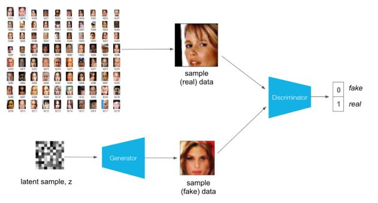

# DCGAN for human faces

 

## About this project 

The goal of this project is to generate human faces using DCGAN

This project is done using [CelebA Dataset](http://mmlab.ie.cuhk.edu.hk/projects/CelebA.html), a large dataset containing human faces of celebrities

### Install
I provide the [environment](https://github.com/titoniubo/DCGAN_human_faces/blob/master/environment.yml) used to run this code.

### Acknowledgments
This project is done thanks to what I learnt at [Udacity](https://eu.udacity.com/course/deep-learning-nanodegree--nd101)

### Code of ethics

This project has been undertaken complying with a code of [ethics](https://github.com/titoniubo/DCGAN_human_faces/blob/master/Code%20of%20ethics.txt) 

### License
This project is under Copyright © 2019 Josep Maria Niubo. It is free software, and may be redistributed under the terms specified in the [LICENSE](https://github.com/titoniubo/DCGAN_human_faces/blob/master/License.txt) file
